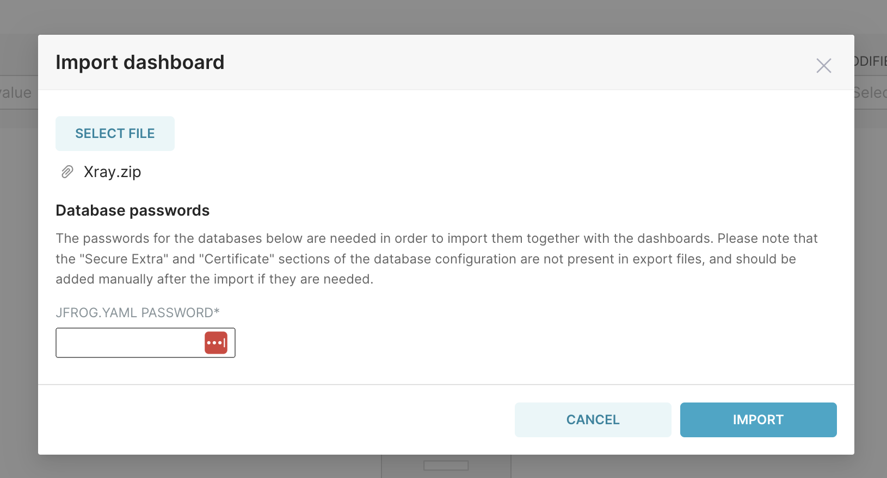
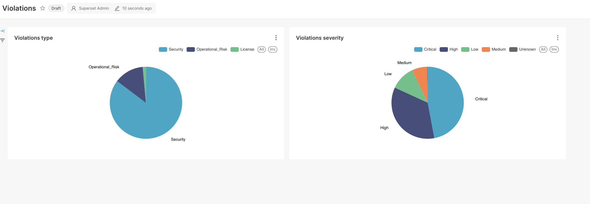
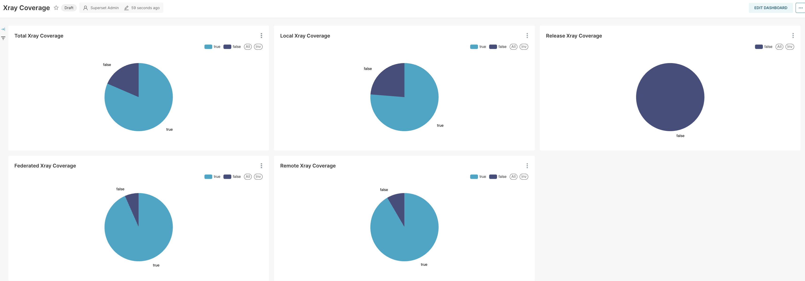

# JFrog Compliance Dashboard
This project provides a scheduler to regularly download data from JFrog and Dashboards using Apache Superset to visualize.

## Available Data
- Artifact Repositories
- Watches
- Policies
- Violations

## Simple setup

1. Clone this repo
2. Make a copy of docker/.env as docker/.env-local (this file is included in .gitignore)
3. Add values for JF_URL and JF_TOKEN 
4. From the root directory run
    a. docker compose up

* The initial start takes a few minutes. Give it 10 minutes on the first `up` before you continue
* In some instances, Superset did not come up correctly. run `docker compose stop` and `docker compose up` to restart.
* Loading the data runs on a schedule. It might take a few minutes to complete the load

Once the environment is up got to http://localhost:8088

Default credentials
user: admin
pass: admin

## Import Dashboards

At the moment I have two dashboards:
- Artifactory: Report on repos covered by Xray
- Violations: Violations :) 

> **Figure:** Import Dashboards

Enter the datbaase password. This is the value of JFROG_PASSWORD in .env-local

Give it a minute and navigate to Dashboards

**Violations**

**Xray Coverage**

For more information on Apache Superset, visit [apache.superset.org](https://apache.superset.org).

## Other endpoints

### Job Queue
Monitor the execution of the data loading jobs
https://loalhost:9181