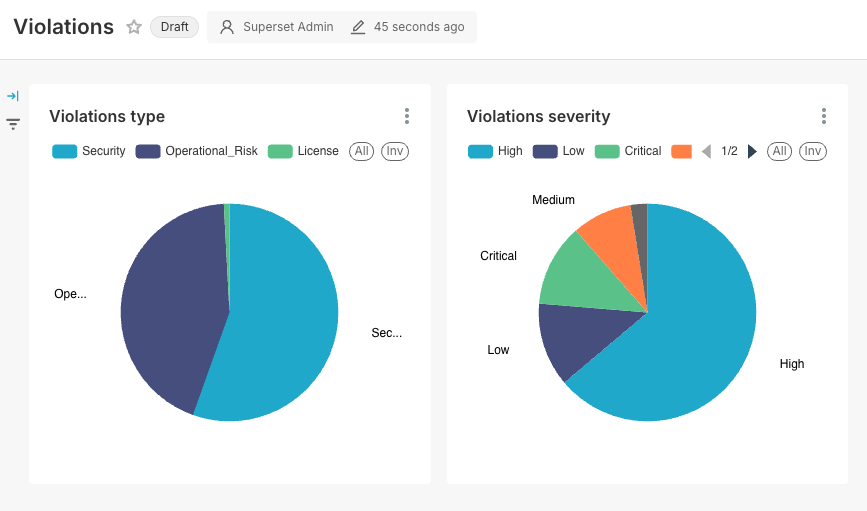

# JFrog Compliance Dashboard



This project provides a scheduler to regularly download data from JFrog and Dashboards using Apache Superset to visualize.

Table of Content

- [Available Data](#available-data)
- [Setup](#setup)
    - [Data Loader + Superset (Recommended)](#dataloader-plus-superset)
        - [Deploy the data loader](#deploy-the-data-loader)
        - [Deploy Superset](#deploy-superset)
    - [All-in-One setup](#all-in-one-setup)        
- [Import Dashboards](#import-dashboards)
- [Login to Superset](#login-to-superset)
- [Clean Up](#clean-up)
- [Other endpoints](#other-endpoints)
    - [Job Queue](#job-queue)

## Available Data
- Artifact Repositories
- Watches
- Policies
- Violations
- Licenses

## Setup

### All in One Setup
This setup includes the data loader and a version of Superset

1. Clone this repo
2. Make a copy of docker/.env as docker/.env-local (this file is included in .gitignore)
    - The file must be in the same location as .env-jfrog and exact name.
3. Add values for JF_URL and JF_TOKEN 
4. From the root directory run `docker compose up`

* The initial start takes a few minutes. Give it 10-20 minutes on the first `up`
* Wait until you see `dashbosard-app` displaying output on the logs before you continue
* In some instances, Superset did not come up correctly. run `docker compose stop` and `docker compose up` to restart.
* Loading the data runs on a schedule. It might take a few minutes to complete the load


### Dataloader Plus Superset

This setup runs the data loader using and Superset with different compose files. It takes more steps to set up, but since we do not want to maintain the Superset files, this is the best way to configure the environment. Also, you might want to use a different BI tool. For that, we expose the Postgres db from the data loader to the localhost. 

#### Deploy the data loader
1. Clone this repo
2. Make a copy of docker/.env-jfrog as docker/.env-local-jfrog (this file is included in .gitignore)
    - The file must be in the same location as .env-jfrog and exact name.
3. Add values for JF_URL and JF_TOKEN 
4. From the root directory run:
    - We add `project-name` to create a docker network we can share with a Superset deployment

```bash
docker compose -f  docker-dataloader-only.yaml --project-name jfrog-dashboard up
```

#### Deploy Superset
If you choose to build your own dashboards using a different BI tools, skip this.
1. Clone Superset (https://github.com/apache/superset.git)
    - Do not clone under the root of the data loader
2. Start Superset 
    - Make a copy of docker/.env as docker/.env-local (this file is included in .gitignore)
    - Edit docker/.env-local and change SUPERSET_LOAD_EXAMPLES to no (unless you want the examples)
    

```bash
docker compose -f docker-compose-non-dev.yml --project-name jfrog-dashboard up
```

## Import Dashboards
This step applies only if you deployed Superset in the same docker project name as the data loader.

From the root directory of this project run 

```bash
# ./import-dashboards.sh
```

## Login to Superset
Once the environment is up go to http://localhost:8088

Default credentials
- user: admin
- pass: admin


For more information on Apache Superset, visit [Superset](https://superset.apache.org).

## Clean Up
Do you want to start over? Clean up the installation 

### Clean up data loader

Stop and remove running containers:
```bash
docker compose -f  docker-dataloader-only.yaml --project-name jfrog-dashboard stop
docker compose -f  docker-dataloader-only.yaml --project-name jfrog-dashboard rm
```

Remove docker volumes
```bash
docker volume rm jfrog-dashboard_jfrog_db jfrog-dashboard_redis_db
```

### Clean up Superset
Run these from the Superset root directory (Clone location)
Stop and remove running containers:
```bash
docker compose -f  docker-compose-non-dev.yml --project-name jfrog-dashboard stop
docker compose -f  docker-compose-non-dev.yml --project-name jfrog-dashboard rm
```

Remove Docker volumes
```bash
docker volume rm jfrog-dashboard_db_home jfrog-dashboard_redis jfrog-dashboard_superset_home
```

## Other endpoints

### Job Queue
Monitor the execution of the data loading jobs
https://loalhost:9181